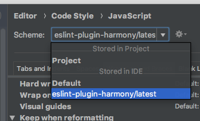
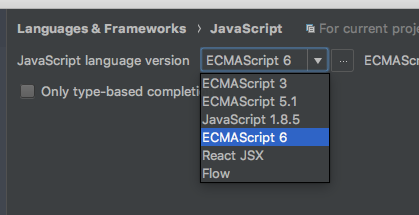

# eslint-plugin-harmony

[![NPM version][npm-image]][npm-url]
[![NPM downloads][downloads-image]][downloads-url]

[![GitHub Action][github-release]][github-action-url]

[![Visual Studio Code][vscode-image]][vscode-url]
[![phpStorm][phpStorm-image]][phpStorm-url]
[![Atom][atom-image]][atom-url]

A [`eslint`](https://eslint.org/) config styles package that work across IDEs.

## Design Principles

There are several configurations available in this package.
Although they are different as they are designed for different programmers,
here are the principles that they all follow:

- They are designed to be used by team
- Each team member can use one of the supported IDE
- The formatter available on each IDE should work with each configuration
- Code should look well and consistent on each IDE with folding
  - so that when you stop by your team member's cube, the code looks the same.
- Thrive for easy to write (with the fewest keystrokes) while keeping the code clean

## Supported IDE

- Visual Studio Code (1.20.0): <https://code.visualstudio.com/>
- phpStorm (2017.3.4): <https://www.jetbrains.com/phpstorm/>
- Atom (1.24.0): <https://atom.io/>

## Installation

You'll first need to install [ESLint](http://eslint.org):

```sh
npm install --save-dev eslint
```

Next, install `eslint-plugin-harmony`:

```sh
npm install --save-dev eslint-plugin-harmony
```

**Note:** If you installed ESLint globally (using the `-g` flag) then you must also install `eslint-plugin-harmony` globally.

## Usage

`eslint-plugin-harmony` ships **two config surfaces**, because ESLint has two config formats:

| Your ESLint | Config file | Use |
|---|---|---|
| 8.57+ | `.eslintrc` | `configs.<name>` — `"extends": "plugin:harmony/recommended"` |
| 9.x | either | `configs.<name>` (needs `ESLINT_USE_FLAT_CONFIG=false`) or `configs.flat.<name>` |
| 10.x | `eslint.config.js` | `configs.flat.<name>` — eslintrc no longer exists in ESLint 10 |

### Flat config (ESLint 9 and 10)

```js
// eslint.config.js
const harmony = require('eslint-plugin-harmony')

module.exports = [
  ...harmony.configs.flat.recommended
]
```

Each entry of `configs.flat` is a **config array**, so spread it. The available names are the
same as the eslintrc ones:

`es5`, `es5-strict`, `latest`, `recommended`, `ts-prettier`, `ts-recommended`,
`ts-recommended-cra`, `ts-recommended-type-check`, `ts-recommended-type-check-cra`,
`ts-recommended-requiring-type-checking`.

Flat config has no `env`, so supply globals yourself:

```js
const globals = require('globals')
const harmony = require('eslint-plugin-harmony')

module.exports = [
  ...harmony.configs.flat.recommended,
  { languageOptions: { globals: globals.node } }
]
```

The `ts-*` flat configs need [`typescript-eslint`](https://typescript-eslint.io) v8 or later
installed. They already scope themselves to `**/*.ts`, `**/*.tsx`, `**/*.mts` and `**/*.cts`,
so mixed JavaScript/TypeScript projects need no `overrides` equivalent — just spread both:

```js
const harmony = require('eslint-plugin-harmony')

module.exports = [
  ...harmony.configs.flat.recommended,
  ...harmony.configs.flat['ts-recommended']
]
```

`ts-recommended-type-check` additionally needs a TypeScript program:

```js
module.exports = [
  ...harmony.configs.flat['ts-recommended-type-check'],
  {
    files: ['**/*.ts', '**/*.tsx'],
    languageOptions: {
      parserOptions: { projectService: true, tsconfigRootDir: __dirname }
    }
  }
]
```

### eslintrc (ESLint 8, and ESLint 9 with `ESLINT_USE_FLAT_CONFIG=false`)

To use the ESLint style, extends from one of the following:

```js
{
  "extends": "plugin:harmony/recommended",
  "extends": "plugin:harmony/latest",
  "extends": "plugin:harmony/es5",
  "extends": "plugin:harmony/es5-strict",
  "extends": "plugin:harmony/ts-prettier", // experimental
  "extends": "plugin:harmony/ts-recommended", // or use overrides
  "extends": "plugin:harmony/ts-recommended-type-check", // or use overrides
  "extends": "plugin:harmony/ts-recommended-cra",
  "extends": "plugin:harmony/ts-recommended-type-check-cra",
}
```

ESLint 9 still reads `.eslintrc`, but only when `ESLINT_USE_FLAT_CONFIG=false` is set, and it
prints a deprecation warning. ESLint 10 removed the format entirely — there is no flag that
brings it back. Move to `configs.flat` before upgrading.

### TypeScript

The TypeScript style is extended from [`@typescript-eslint/eslint-plugin`](https://github.com/typescript-eslint/typescript-eslint/tree/master/packages/eslint-plugin).

They are adjusted to the style in harmony.
Also, the configuration are simplified.

Since you will likely to have some JavaScript files in your TypeScript project (e.g. `jest.config.js`, `webpack.config.js`, etc.),
it is recommended to use the `overrides.extends` feature in `eslint` to support mixed environment:

```js
{
  "extends": [
    "plugin:harmony/recommended"
  ],
  "overrides": [
    {
      "files": [
        "*.ts",
        "*.tsx"
      ],
      "extends": [
        "plugin:harmony/ts-recommended"
      ]
    }
  ]
}
```

Note that for `ts-recommended-type-check` you still need to specify `parserOptions.project`.

```json
{
  "extends": [
    "plugin:harmony/recommended"
  ],
  "overrides": [
    {
      "files": [
        "*.ts",
        "*.tsx"
      ],
      "extends": [
        "plugin:harmony/ts-recommended-type-check"
      ],
      "parserOptions": {
        "project": "tsconfig.json"
      }
    }
  ]
}
```

For more information, please check out [@typescript-eslint/eslint-plugin](https://github.com/typescript-eslint/typescript-eslint/tree/master/packages/eslint-plugin).

### Peer dependencies

This package no longer bundles `@typescript-eslint/parser`. Install what you need:

```sh
npm i -D eslint                                        # required, >= 8.57
npm i -D typescript-eslint                             # for the flat `ts-*` configs
npm i -D @typescript-eslint/eslint-plugin @typescript-eslint/parser   # for the eslintrc `ts-*` configs
npm i -D eslint-config-prettier                        # for `ts-prettier`
```

### JetBrains IDE

After you import the settings,
you need to use them in the setting:



You also need to change your language version appropriately:



## Contribute

```sh
pnpm i
pnpm verify   # build, typecheck, lint (with this plugin's own flat config), test
```

The test suite lints the fixtures under `spec/<config>/` with every published config and
asserts the rule ids and counts encoded in the filenames. `test/configs.spec.ts` covers the
eslintrc surface, `test/flat-configs.spec.ts` the flat one, against the same fixtures — so
the two surfaces cannot drift apart.

[npm-image]: https://img.shields.io/npm/v/eslint-plugin-harmony.svg?style=flat
[npm-url]: https://npmjs.org/package/eslint-plugin-harmony
[downloads-image]: https://img.shields.io/npm/dm/eslint-plugin-harmony.svg?style=flat
[downloads-url]: https://npmjs.org/package/eslint-plugin-harmony
[github-release]: https://github.com/cyberuni/eslint-plugin-harmony/workflows/release/badge.svg
[github-action-url]: https://github.com/cyberuni/eslint-plugin-harmony/actions
[vscode-image]:https://img.shields.io/badge/vscode-ready-green.svg
[vscode-url]:https://code.visualstudio.com/
[phpStorm-image]:https://img.shields.io/badge/phpStorm-ready-green.svg
[phpStorm-url]:https://www.jetbrains.com/phpstorm/
[atom-image]:https://img.shields.io/badge/atom-ready-green.svg
[atom-url]:https://atom.io/
